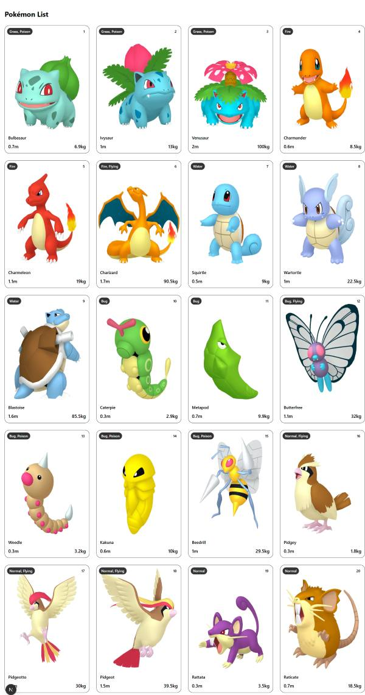

# Pokémon 20 — Next.js + TypeScript

A tiny, responsive web app that lists the **first 20 Pokémon** (sorted by ID) with their **name, image, type(s), height (m), and weight (kg)**. Built with **Next.js (App Router) + TypeScript** and tested with **Jest DOM**.



---

## Prerequisites

- **Node.js 20+** (recommended LTS)
- **npm 10+**

Check versions:
```bash
node -v
npm -v
```

---

## Getting Started

### 1) Clone & install
```bash

git clone https://github.com/tofaruk/pokemon.git pokemon
cd pokemon

# install dependencies
npm install
```

### 2) Run in dev
```bash
npm run dev
# open http://localhost:3000
```

### 3) Build & run production
```bash
npm run build
npm start
# open http://localhost:3000
```

> The app fetches data from the public PokéAPI. The UI is responsive and uses `next/image` for optimized images and an accessible layout.

---

## Running Tests

This project uses **Jest** + **@testing-library/react** + **@testing-library/jest-dom**.

- Run all tests:
```bash
npm run test
```

- Watch mode:
```bash
npm run test:watch
```

- Lint and typecheck (recommended before pushing):
```bash
npm run lint
npm run typecheck
```

### What’s covered

- **Unit**: `PokemonCard` renders attributes and handles empty types.
- **Integration**: the **Home Page** renders the heading and 20 cards (via mocked service).
  
Minimal and focused—just enough QA for a small challenge.

---

## Project Structure (excerpt)

```
app/
  page.tsx            # Home (async server component)
components/
  PokemonCard.tsx     # Single Pokémon card
lib/
  types.ts            # Shared types
  helper.ts           # Unitily functions 
service/
  pokemonApi.ts       # Data fetching (PokeAPI)
__tests__/
  components/
    PokemonCard.test.tsx
  app/
    page.test.tsx
public/               # static assets
docs/
  screenshot-full.png # full-page preview (included above)
```

## Notes

- Sorting: items are **sorted by ID ascending** before render.
- Responsiveness: grid scales from 1→4 columns (`sm`/`lg`/`xl` breakpoints).
- Error handling: the fetch layer tolerates partial failures so one bad item doesn’t break the page.
- Tech stack: Next.js (App Router) · TypeScript · Testing Library/Jest · Tailwind CSS.
